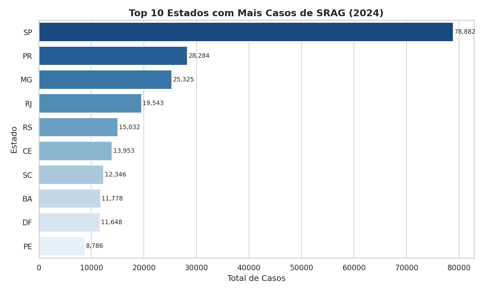
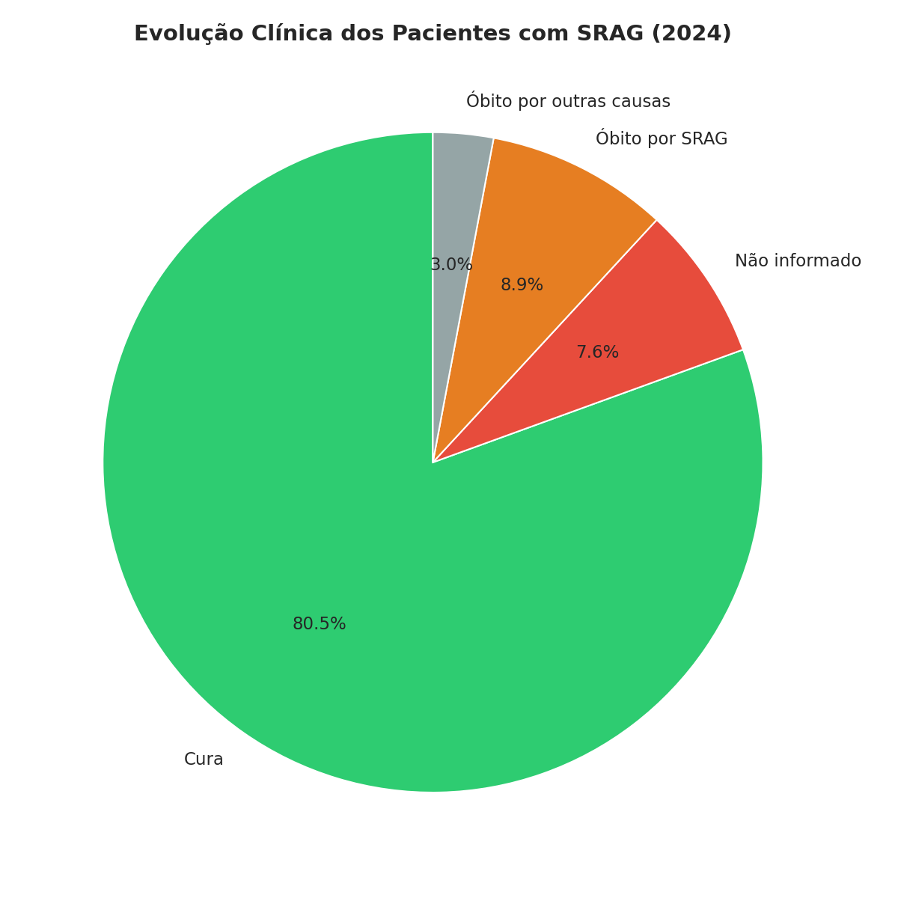
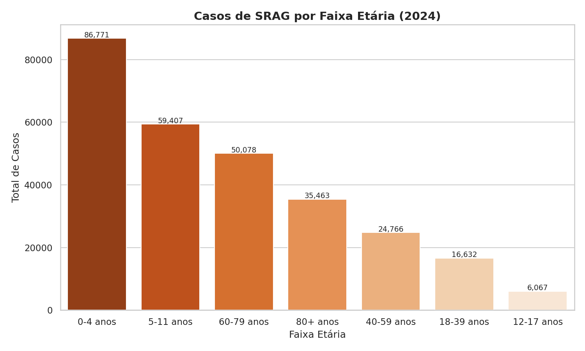

ipeline de dados completo para análise de Síndrome Respiratória Aguda Grave (SRAG) no Brasil, utilizando dados públicos do **OpenDataSUS / DATASUS** referentes ao ano de 2024.

---

## 📊 Resultados

### Top 10 Estados com Mais Casos de SRAG (2024)


### Evolução Clínica dos Pacientes


### Distribuição por Faixa Etária


---

## 🔍 Principais Insights

- **São Paulo** concentra ~28% de todos os casos notificados no Brasil
- **80,5%** dos pacientes tiveram cura registrada
- Crianças de **0 a 4 anos** são o grupo mais afetado, com 86.771 casos
- Os **10 maiores estados** respondem por mais de 80% dos casos nacionais

---

## 🏗️ Arquitetura do Pipeline
```
[1. Ingestão]      → Leitura do CSV bruto do OpenDataSUS (pandas)
[2. Limpeza]       → Remoção de nulos, seleção de colunas relevantes (pandas)
[3. Análise SQL]   → Queries analíticas sobre os dados limpos (DuckDB)
[4. Visualização]  → Geração de gráficos para comunicação dos resultados (matplotlib + seaborn)
```

---

## 🗂️ Estrutura do Projeto
```
saude-publica-analytics/
├── assets/                          # Gráficos gerados
│   ├── 01_casos_por_estado.png
│   ├── 02_evolucao_clinica.png
│   └── 03_faixa_etaria.png
├── data/
│   ├── raw/                         # Dados brutos (não versionados)
│   └── processed/                   # Dados limpos
├── notebooks/
│   ├── 01_ingestao.ipynb
│   ├── 02_limpeza.ipynb
│   ├── 03_analise_sql.ipynb
│   └── 04_visualizacao.ipynb
├── src/
│   └── pipeline.py
├── requirements.txt
└── README.md
```

---

## 🛠️ Tecnologias Utilizadas

| Tecnologia | Uso no Projeto |
|---|---|
| Python 3.x | Linguagem principal |
| pandas | Ingestão e limpeza de dados |
| DuckDB | Análise SQL sobre DataFrames |
| matplotlib | Visualizações base |
| seaborn | Visualizações estatísticas |
| Jupyter | Desenvolvimento interativo |

---

## 📥 Como Reproduzir

### 1. Clone o repositório
```bash
git clone https://github.com/brerreira8/saude-publica-analytics.git
cd saude-publica-analytics
```

### 2. Crie o ambiente virtual
```bash
python -m venv .venv
source .venv/bin/activate
pip install -r requirements.txt
```

### 3. Baixe os dados
Acesse o portal [OpenDataSUS](https://opendatasus.saude.gov.br/dataset/srag-2021-a-2024) e baixe o arquivo `INFLUD24.csv`. Salve em `data/raw/`.

### 4. Execute os notebooks na ordem
```
01_ingestao.ipynb → 02_limpeza.ipynb → 03_analise_sql.ipynb → 04_visualizacao.ipynb
```

---

## 📦 Fonte dos Dados

- **Portal:** [OpenDataSUS](https://opendatasus.saude.gov.br)
- **Dataset:** SRAG 2024 — Síndrome Respiratória Aguda Grave
- **Registros:** 279.184 notificações
- **Colunas utilizadas:** 16 de 190 disponíveis

---

## 👨‍💻 Autor

Desenvolvido como projeto de portfólio para a área de **Data Analytics / Big Data**.

[](https://linkedin.com/in/SEU-USUARIO)
[](https://github.com/brerreira8)
